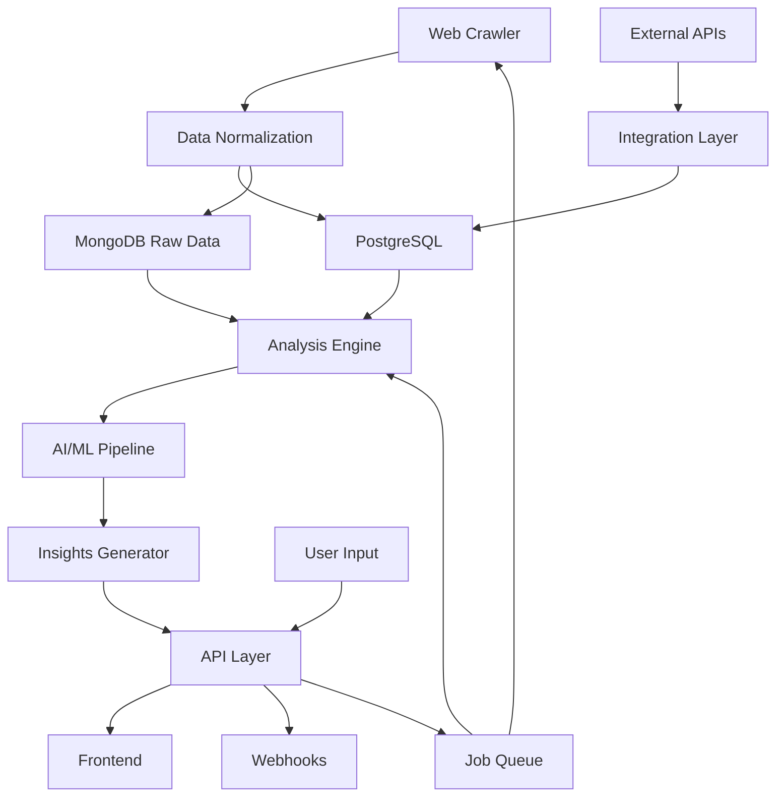

# UNIVERSAL SEO INTELLIGENCE PLATFORM
## Enterprise-Grade Multi-Tenant SEO Suite (140,000+ LOC)

---

## 🎯 PROJECT OVERVIEW

### Vision
Bygga världens mest kraftfulla SEO-plattform som kombinerar:
- 50+ specialiserade SEO-verktyg i ett unified interface
- Real-time data processing för miljontals URLs
- AI-driven insights och automation
- Multi-tenant SaaS arkitektur (återanvändbar för alla framtida projekt)
- API-first design för maximal flexibilitet

### Business Model
- **Freemium**: 10 searches/dag
- **Pro**: $299/mån - 1,000 searches/dag
- **Business**: $999/mån - 10,000 searches/dag  
- **Enterprise**: $2,999+/mån - unlimited + custom features
- **White Label**: $10K setup + 20% revenue share
- **API Access**: $0.10 per 1000 API calls

---

## 🏗️ TECHNICAL ARCHITECTURE

### Core Stack
```yaml
Backend:
  - Primary: Node.js (NestJS) - för API och business logic
  - Secondary: Python (FastAPI) - för ML/AI och data processing
  - Performance: Go - för crawlers och high-throughput operations
  
Database Layer:
  - PostgreSQL: Primary datastore med TimescaleDB för time-series
  - MongoDB: Flexible document storage för crawl data
  - Redis: Caching + real-time leaderboards
  - Elasticsearch: Full-text search och analytics
  - ClickHouse: Analytics och stora datasets
  
Message Queue:
  - Apache Kafka: Event streaming
  - Redis Bull: Job queues
  - RabbitMQ: Service communication
  
Frontend:
  - Next.js 14: Main application
  - React Query: Data fetching
  - Zustand: State management
  - D3.js + Recharts: Visualizations
  - Tailwind: Styling
```

### Database Schema (Multi-Tenant)
```sql
-- Core tenant structure (återanvändbar i alla projekt!)
CREATE TABLE tenants (
    id UUID PRIMARY KEY DEFAULT gen_random_uuid(),
    slug VARCHAR(50) UNIQUE NOT NULL,
    name VARCHAR(255) NOT NULL,
    plan VARCHAR(50) DEFAULT 'free',
    settings JSONB DEFAULT '{}',
    created_at TIMESTAMPTZ DEFAULT NOW()
);

-- Projects (workspace concept)
CREATE TABLE projects (
    id UUID PRIMARY KEY DEFAULT gen_random_uuid(),
    tenant_id UUID REFERENCES tenants(id),
    name VARCHAR(255) NOT NULL,
    domain VARCHAR(255),
    settings JSONB DEFAULT '{}',
    created_at TIMESTAMPTZ DEFAULT NOW()
);

-- SEO-specific tables
CREATE TABLE domains (
    id UUID PRIMARY KEY DEFAULT gen_random_uuid(),
    project_id UUID REFERENCES projects(id),
    domain VARCHAR(255) NOT NULL,
    authority_score DECIMAL(5,2),
    organic_traffic BIGINT,
    indexed_pages INTEGER,
    last_crawled TIMESTAMPTZ,
    UNIQUE(project_id, domain)
);

CREATE TABLE keywords (
    id UUID PRIMARY KEY DEFAULT gen_random_uuid(),
    project_id UUID REFERENCES projects(id),
    keyword VARCHAR(500) NOT NULL,
    search_volume INTEGER,
    difficulty DECIMAL(5,2),
    cpc DECIMAL(10,2),
    intent VARCHAR(50),
    serp_features JSONB,
    last_updated TIMESTAMPTZ DEFAULT NOW()
);

-- Time-series data för ranking tracking
CREATE TABLE rankings (
    project_id UUID,
    keyword_id UUID,
    domain_id UUID,
    position INTEGER,
    url TEXT,
    timestamp TIMESTAMPTZ DEFAULT NOW(),
    PRIMARY KEY (project_id, keyword_id, domain_id, timestamp)
);

-- Crawl data storage
CREATE TABLE pages (
    id UUID PRIMARY KEY DEFAULT gen_random_uuid(),
    domain_id UUID REFERENCES domains(id),
    url TEXT NOT NULL,
    title TEXT,
    meta_description TEXT,
    h1 TEXT,
    word_count INTEGER,
    internal_links INTEGER,
    external_links INTEGER,
    page_speed_score DECIMAL(5,2),
    content_hash VARCHAR(64),
    structured_data JSONB,
    last_crawled TIMESTAMPTZ
);

-- Backlinks (stor data!)
CREATE TABLE backlinks (
    id UUID PRIMARY KEY DEFAULT gen_random_uuid(),
    source_domain VARCHAR(255),
    source_url TEXT,
    target_domain_id UUID REFERENCES domains(id),
    target_url TEXT,
    anchor_text TEXT,
    rel_attributes VARCHAR(50)[],
    first_seen TIMESTAMPTZ DEFAULT NOW(),
    last_checked TIMESTAMPTZ DEFAULT NOW(),
    is_active BOOLEAN DEFAULT true
);

-- API usage tracking (för billing)
CREATE TABLE api_usage (
    tenant_id UUID REFERENCES tenants(id),
    endpoint VARCHAR(255),
    timestamp TIMESTAMPTZ DEFAULT NOW(),
    response_time_ms INTEGER,
    credits_used INTEGER DEFAULT 1
);
```

---

## 🚀 FEATURE MODULES

### 1. Crawler Infrastructure (15K LOC)
```yaml
Features:
  - Distributed crawling med 100+ nodes
  - JavaScript rendering support
  - Robots.txt respect
  - Rate limiting per domain
  - Change detection
  
Tech:
  - Puppeteer cluster för JS-heavy sites
  - Go workers för speed
  - Kafka för job distribution
```

### 2. Keyword Research Suite (12K LOC)
```yaml
Features:
  - Keyword suggestions från 10+ källor
  - Search intent classification (AI-driven)
  - SERP feature analysis
  - Competitor gap analysis
  - Long-tail keyword generator
  
Integrations:
  - Google Ads API
  - Google Search Console
  - SEMrush API (för jämförelse)
```

### 3. Rank Tracking System (10K LOC)
```yaml
Features:
  - Daily rank tracking
  - Mobile vs Desktop
  - Local rank tracking (city-level)
  - SERP screenshot storage
  - Rank change alerts
  
Scale:
  - Track 1M+ keywords daily
  - 100+ locations
  - Historical data retention
```

### 4. Backlink Analysis (15K LOC)
```yaml
Features:
  - Real-time backlink discovery
  - Link quality scoring (AI-based)
  - Anchor text analysis
  - Lost/New link alerts
  - Competitor backlink spying
  
Data Sources:
  - Own crawler
  - Common Crawl integration
  - Third-party APIs
```

### 5. Content Analysis Engine (18K LOC)
```yaml
Features:
  - Content scoring (vs top 10)
  - Readability analysis
  - Topic modeling
  - Content gap finder
  - AI-powered optimization suggestions
  
ML Models:
  - BERT för semantic analysis
  - Custom models för SEO-specific metrics
```

### 6. Technical SEO Auditor (12K LOC)
```yaml
Features:
  - 200+ technical checks
  - Core Web Vitals monitoring
  - Schema markup validation
  - Mobile-friendliness testing
  - Security issue detection
  
Reports:
  - Exportable PDF reports
  - White-label options
  - Scheduled audits
```

### 7. AI SEO Assistant (20K LOC)
```yaml
Features:
  - Natural language queries
  - Automated insight generation
  - Strategy recommendations
  - Content briefs generation
  - Predictive analytics
  
Tech:
  - OpenAI integration
  - Custom fine-tuned models
  - Retrieval Augmented Generation
```

### 8. API & Integrations Layer (10K LOC)
```yaml
Endpoints:
  - RESTful API
  - GraphQL for complex queries
  - Webhook system
  - Bulk data export
  
Integrations:
  - Google Analytics 4
  - Search Console
  - WordPress plugin
  - Slack/Teams notifications
```

### 9. Analytics & Reporting (15K LOC)
```yaml
Features:
  - Custom dashboards
  - Scheduled reports
  - Data visualization
  - ROI tracking
  - Multi-project comparison
  
Tech:
  - ClickHouse för analytics
  - D3.js för visualizations
  - PDF generation
```

### 10. Multi-Tenant Admin System (13K LOC)
```yaml
Features:
  - User management
  - Billing & subscriptions
  - Resource limits
  - White-label configuration
  - Super admin panel
  
Billing:
  - Stripe integration
  - Usage-based billing
  - Invoice generation
```

---

## 👥 TEAM ORCHESTRATION PLAN

### **TEAM ALPHA - Database & Core Architecture (15K LOC)**
```yaml
Responsibility: Foundation som alla andra bygger på
Deliverables:
  - Complete database schema
  - Multi-tenant architecture
  - Core models and entities
  - Authentication system
  - Event bus infrastructure
  - Caching layer
  - API rate limiting
  - Tenant isolation
  - Database migrations
  - Seed data system
```

### **TEAM BETA - Crawler & Data Collection (20K LOC)**
```yaml
Responsibility: All data collection infrastructure
Deliverables:
  - Distributed crawler system
  - JavaScript rendering
  - Robots.txt parser
  - URL queue management
  - Change detection
  - Screenshot service
  - Data normalization
  - Storage optimization
  - Crawler monitoring
  - Anti-bot detection handling
```

### **TEAM GAMMA - SEO Analysis Engine (25K LOC)**
```yaml
Responsibility: Core SEO analysis features
Deliverables:
  - Keyword research module
  - Rank tracking system
  - SERP analysis
  - Content analyzer
  - Competitor tracking
  - Search intent classifier
  - Trending topics finder
  - Opportunity scorer
  - SEO scoring algorithms
  - Insights generator
```

### **TEAM DELTA - External Integrations (15K LOC)**
```yaml
Responsibility: All third-party connections
Deliverables:
  - Google APIs integration
  - Social media APIs
  - Payment processing
  - Email service
  - Analytics platforms
  - CMS plugins
  - Webhook system
  - OAuth providers
  - Data import/export
  - API client libraries
```

### **TEAM EPSILON - Frontend Application (20K LOC)**
```yaml
Responsibility: Complete web interface
Deliverables:
  - Dashboard layouts
  - Data visualizations
  - Report builders
  - Project management UI
  - User settings
  - Onboarding flow
  - Mobile responsive
  - Real-time updates
  - Drag-drop builders
  - White-label theming
```

### **TEAM ZETA - API & Developer Tools (15K LOC)**
```yaml
Responsibility: Public API and SDKs
Deliverables:
  - RESTful API
  - GraphQL endpoint
  - API documentation
  - Client SDKs (JS, Python, PHP)
  - Rate limiting
  - API key management
  - Webhook system
  - Postman collection
  - OpenAPI spec
  - Code examples
```

### **TEAM ETA - DevOps & Infrastructure (10K LOC)**
```yaml
Responsibility: Production deployment
Deliverables:
  - Docker configurations
  - Kubernetes manifests
  - CI/CD pipelines
  - Monitoring setup
  - Log aggregation
  - Backup strategies
  - Auto-scaling policies
  - Security hardening
  - Database optimization
  - CDN configuration
```

### **TEAM THETA - ML/AI Components (15K LOC)**
```yaml
Responsibility: Intelligence layer
Deliverables:
  - Content quality scorer
  - Keyword clustering
  - Intent prediction
  - Trend forecasting
  - Anomaly detection
  - Natural language queries
  - Recommendation engine
  - Competitor analysis AI
  - Auto-tagging system
  - Predictive rankings
```

### **TEAM IOTA - Testing & Quality (10K LOC)**
```yaml
Responsibility: Comprehensive testing
Deliverables:
  - Unit test suites
  - Integration tests
  - E2E test scenarios
  - Performance tests
  - Load testing
  - Security tests
  - API contract tests
  - Crawler tests
  - Multi-tenant tests
  - Chaos engineering
```

### **TEAM KAPPA - Business Features (10K LOC)**
```yaml
Responsibility: Monetization and growth
Deliverables:
  - Billing system
  - Subscription management
  - Usage tracking
  - Invoice generation
  - Affiliate system
  - Referral program
  - Admin analytics
  - Revenue reports
  - Churn prevention
  - Upsell automation
```

---

## 📊 DATA FLOW ARCHITECTURE



---

## 🚀 IMPLEMENTATION TIMELINE

### Phase 1: Foundation (Week 1)
- Team Alpha: Complete database and core
- Team Beta: Basic crawler
- Team Gamma: Simple keyword research
- All teams: Create mega-files

### Phase 2: Core Features (Week 1-2)  
- Full crawler infrastructure
- Rank tracking system
- Basic frontend
- API structure

### Phase 3: Advanced Features (Week 2)
- ML/AI components
- Advanced analytics
- White-label support
- Full integration suite

---

## 💎 UNIQUE SELLING POINTS

1. **50+ SEO Tools Unified** - Allt på ett ställe
2. **Real AI, Not Buzzwords** - Faktisk intelligens
3. **Unlimited Data Retention** - Historik forever
4. **True Multi-Tenant** - White-label ready
5. **Developer Friendly** - API-first design
6. **Swedish Market Focus** - Lokal support
7. **Transparent Pricing** - Ingen BS
8. **Open Metrics** - Visa hur vi räknar
9. **Custom Crawl Rules** - För enterprise
10. **No Vendor Lock-in** - Exportera allt

---

## 📈 SCALING STRATEGY

### Technical Scaling
```yaml
Month 1: Single server (handel 100 users)
Month 3: Kubernetes cluster (1,000 users)
Month 6: Multi-region deployment (10,000 users)
Year 1: Global CDN + Edge computing (100,000 users)
```

### Business Scaling
```yaml
Phase 1: Swedish market
Phase 2: Nordics
Phase 3: Europe  
Phase 4: Global
```

---

## 🎯 SUCCESS METRICS

### Technical KPIs
- API response time <200ms
- 99.9% uptime SLA
- Crawl 1M pages/hour
- Process 100K keywords/minute

### Business KPIs
- 1,000 paying customers in 6 months
- $100K MRR in year 1
- 50% YoY growth
- <5% monthly churn

---

## 🔐 SECURITY & COMPLIANCE

- SOC 2 Type II compliant
- GDPR ready from day 1
- Encrypted data at rest and in transit
- Regular security audits
- PCI compliant for payments
- Row-level security in database
- API rate limiting and DDoS protection

---

## 💰 MONETIZATION OPPORTUNITIES

### Direct Revenue
1. SaaS subscriptions
2. API usage fees
3. White-label licensing
4. Custom enterprise features
5. Professional services

### Indirect Revenue
1. Affiliate commissions
2. Marketplace for SEO services
3. Educational content
4. Certification program
5. Partner integrations

---

## 🎬 NEXT STEPS

1. Generate team mega-files
2. Set up development environment
3. Initialize orchestration
4. Begin parallel development
5. Daily integration cycles

This platform will be the foundation for everything else you build!
